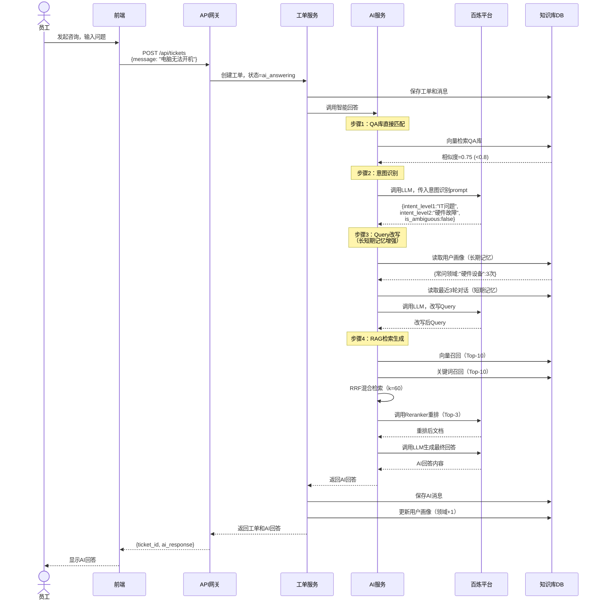
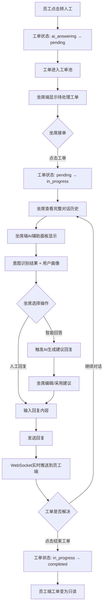
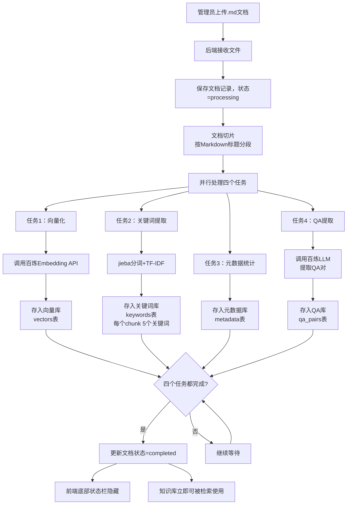

# 智能客服系统 - 产品需求文档（PRD）

**项目名称**：智能客服系统  
**项目 ID**：smart-customer-service  
**项目类型**：Web 应用  
**文档版本**：V1.0 - 初稿  
**最后更新**：2026-05-20

---

## 1. 背景与调研结论

### 1.1 产品定位

为企业内部 IT 团队打造一个智能化客服系统，通过 AI 检索生成能力（RAG + 意图识别 + 长短期记忆）快速响应员工 IT 咨询（硬件、软件、权限问题），同时支持人工坐席高效处理复杂问题，持续积累知识库，提升企业 IT 服务效率和员工满意度。

### 1.2 竞品调研结论

经过对钉钉服务台、飞书服务台、Zendesk 的调研，我们选择了**方案 C（AI 增强型）**作为产品设计方向：

**核心特色**：
- **充分展示 AI 能力**：QA 库直接匹配、意图识别、长短期记忆、RAG 检索生成
- **坐席 AI 辅助面板**：意图识别结果、用户画像、智能建议回复、相关知识库推荐
- **专业工具定位**：面向企业内部 IT 团队，对专业工具接受度高
- **技术感视觉风格**：深色侧边栏 + 白色主区域，突出智能能力

**页面结构**：
- **员工端**：中心对话区（全屏），左侧折叠工单历史，顶部状态指示
- **坐席端**：三栏布局（左侧工单池、中间对话详情、右侧 AI 辅助面板）
- **知识库管理**：文档管理 + 入库状态监控 + QA 库查看

---

## 2. Mission & Persona

### 2.1 Mission（使命）

为企业内部 IT 团队打造一个智能化客服系统，通过 AI 检索生成能力快速响应员工 IT 咨询（硬件、软件、权限问题），同时支持人工坐席高效处理复杂问题，持续积累知识库，提升企业 IT 服务效率和员工满意度。

### 2.2 Persona（目标用户画像）

**角色 1：企业员工（咨询方）**
- **身份**：企业内部员工（技术/非技术岗位）
- **场景**：工作中遇到 IT 问题（电脑故障、软件无法使用、权限受限等）
- **需求**：快速获得解决方案，减少等待时间，降低沟通成本
- **痛点**：传统 IT 服务响应慢、需要电话/邮件多次沟通、重复问题每次都要问

**角色 2：IT 坐席人员（支持方）**
- **身份**：企业 IT 部门客服人员
- **场景**：每天处理大量重复性 IT 咨询工单
- **需求**：快速定位问题、减少重复回答、提高处理效率、积累问题解决方案
- **痛点**：重复问题占用大量时间、缺乏智能辅助、知识分散难查找

---

## 3. 页面清单与跳转逻辑

### 3.1 页面清单

| 序号 | 页面名称 | 页面类型 | 可见角色 | 入口来源 | 跳转去向 |
|------|---------|---------|---------|---------|---------|
| P01 | 登录页 | 表单页 | 未登录用户 | 直接访问 | 员工端/坐席端/知识库管理 |
| P02 | 员工端 - 咨询对话页 | 对话页 + 列表 | 所有已登录用户 | 登录后默认页、顶部导航 | 坐席端、知识库管理 |
| P03 | 坐席端 - 工单管理页 | 三栏布局（工单池 + 对话详情 + AI 辅助） | 所有已登录用户 | 顶部导航 | 员工端、知识库管理 |
| P04 | 知识库管理页 | 列表 + 上传表单 + 状态监控 | 所有已登录用户 | 顶部导航 | 员工端、坐席端 |

### 3.2 全局布局结构

**通用顶部导航**（P02/P03/P04 共享）：
- 左侧：系统 Logo + 名称
- 中间：导航菜单（员工端、坐席端、知识库管理）
- 右侧：用户信息 + 退出登录

**权限说明**：
- 暂不做用户角色隔离，所有已登录用户可访问所有界面

**响应式设计**：
- 主要面向 PC 端使用（1440px 及以上）
- 移动端兼容（简化版布局，V2+ 优化）

### 3.3 页面跳转图

```text
登录页 (P01)
    ↓ （登录成功）
    ├─→ 员工端 (P02) ←→ 坐席端 (P03) ←→ 知识库管理 (P04)
    │      ↑                ↑                    ↑
    │      └────────────────┴────────────────────┘
    │              （顶部导航自由切换）
    │
    └─→ （退出登录） → 登录页 (P01)
```

### 3.4 各页面布局详情

#### P02 - 员工端（对话页）
**布局**：
- **左侧（300px）**：历史工单列表（可折叠）
  - 工单卡片：时间、首条消息预览、状态标签
  - 支持筛选：全部/进行中/已完结
- **中心区域**：对话窗口
  - 顶部：工单状态指示（AI 回答中/人工处理中/已完结）
  - 主体：消息气泡区（用户消息/AI 消息/人工消息）
  - 底部：输入框 + "转人工"按钮
- **右侧（可选）**：常见问题推荐（V2+）

#### P03 - 坐席端（三栏布局）
**布局**：
- **左侧（280px）**：工单池
  - 分组：待处理/处理中/已完成
  - 工单卡片：员工昵称、首条消息、等待时长
  - 点击卡片 → 中间展开详情
- **中间（600px）**：工单对话详情
  - 顶部：员工信息、工单编号、状态
  - 主体：对话历史（完整上下文）
  - 底部：回复输入框 + 快捷操作（智能回答、结束工单）
- **右侧（360px）**：AI 辅助面板
  - 意图识别结果（一级/二级意图）
  - 用户画像（常问领域、历史咨询次数）
  - 智能建议回复（可一键采用或编辑）
  - 相关知识库文档（快速插入，V2+）
  - 工单分类（自动建议 + 手动调整，V2+）

#### P04 - 知识库管理页
**布局**：
- **左侧（240px）**：文档分类导航（树形，V2+）
- **中心区域**：文档列表
  - 文档名称、上传时间、状态（处理中/已入库）
  - 操作：预览（V1.1）、删除（V1.1）
- **右上角**：上传按钮
- **底部**：入库状态监控（实时显示入库进度）

---

## 4. 主要功能定义与分析

### 4.1 页面：P01 - 登录页

#### 功能清单

| 功能编号 | 功能名称 | 一句话描述 | 用户可感知的完成标准 |
|---------|---------|-----------|-------------------|
| F-01-01 | 账号密码登录 | 用户输入账号密码进行身份验证 | 登录成功后跳转到员工端，显示用户昵称 |

#### 功能边界

| 功能编号 | 包含 | 不包含 |
|---------|------|--------|
| F-01-01 | 账号密码输入、验证、记住密码选项、错误提示 | 第三方登录（微信/钉钉）、注册功能、找回密码 |

---

### 4.2 页面：P02 - 员工端（咨询对话页）

#### 功能清单

| 功能编号 | 功能名称 | 一句话描述 | 用户可感知的完成标准 |
|---------|---------|-----------|-------------------|
| F-02-01 | 发起咨询 | 员工输入问题并发送 | 消息显示在对话区，AI 开始回答或显示"处理中" |
| F-02-02 | 接收 AI 智能回答 | 系统自动处理并返回 AI 回答 | 对话区显示 AI 回复消息（带"AI"标识） |
| F-02-03 | 转人工服务 | 员工主动请求人工客服介入 | 点击"转人工"后，状态变为"等待人工客服"，工单进入坐席端工单池 |
| F-02-04 | 查看历史工单 | 查看过往咨询记录列表 | 左侧列表显示所有历史工单，包含时间、首条消息预览、状态 |
| F-02-05 | 继续历史对话 | 选择未完结工单继续咨询 | 点击工单卡片，右侧加载完整对话历史，可继续发送消息 |

#### 功能边界

| 功能编号 | 包含 | 不包含 |
|---------|------|--------|
| F-02-01 | 文本输入、发送按钮、输入状态显示 | 语音输入、图片上传、文件上传 |
| F-02-02 | AI 回答显示、意图模糊时的反问 | 显示意图识别结果（对员工不可见，仅在坐席端可见） |
| F-02-03 | "转人工"按钮、转人工确认提示 | 自动转人工、智能推荐转人工 |
| F-02-04 | 工单列表、筛选（全部/进行中/已完结） | 搜索历史消息、导出对话记录 |
| F-02-05 | 继续对话、查看完整历史 | 修改历史消息、删除工单 |

#### F-02-02 AI 智能回答完整链路（核心能力）

**技术链路**：
1. **QA 库直接匹配**：用户 Query 向量化后检索 QA 库，计算相似度
   - 相似度 ≥ 0.8：直接返回匹配的 Answer
   - 相似度 < 0.8：进入后续流程
2. **意图识别**：模型输出带意图判断的 JSON
   - 意图模糊（is_ambiguous=true）：系统反问，要求用户提供更多细节
   - 意图清晰：进入后续逻辑
3. **Query 改写**：结合长短期记忆改写用户 Query
   - 长期记忆：用户画像（常问领域），从 SQLite 读取
   - 短期记忆：最近 3 轮对话窗口
4. **RAG 检索生成**：向量召回 + 关键词召回，RRF 混合检索，Reranker 重排后生成回答

#### F-02-05 继续历史对话的状态约束

```text
员工查看历史工单列表
    ↓
选择工单（点击工单卡片）
    ↓
判断工单状态
    ├─ 状态 = "已完成" → 只读模式（显示完整对话历史，输入框禁用）
    └─ 状态 = "AI 回答中" 或 "待处理" 或 "处理中" → 可继续发送消息
```

---

### 4.3 页面：P03 - 坐席端（工单管理页）

#### 功能清单

| 功能编号 | 功能名称 | 一句话描述 | 用户可感知的完成标准 |
|---------|---------|-----------|-------------------|
| F-03-01 | 查看工单池 | 展示待处理/处理中/已完成的工单列表 | 左侧显示三个分组，每个工单显示员工昵称、首条消息、等待时长 |
| F-03-02 | 接单（进入处理） | 坐席人员选择工单开始处理 | 点击工单卡片，中间区域显示完整对话，工单状态变为"处理中" |
| F-03-03 | 查看工单详情 | 查看工单的完整对话历史和员工信息 | 中间区域显示工单编号、员工信息、完整对话记录 |
| F-03-04 | 人工回复员工 | 坐席人员输入并发送回复 | 消息发送后显示在对话区（带"人工客服"标识），实时同步到员工端 P02 |
| F-03-05 | 智能回答辅助 | 触发 AI 生成建议回复 | 点击"智能回答"按钮，右侧 AI 辅助面板显示建议回复，可一键采用或编辑 |
| F-03-06 | 查看意图识别结果 | 展示员工问题的意图分析 | 右侧 AI 辅助面板显示一级意图、二级意图（实时更新） |
| F-03-07 | 查看用户画像 | 展示员工的常问领域和历史咨询统计 | 右侧 AI 辅助面板显示用户画像卡片（V1.2） |
| F-03-08 | 工单分类 | 对工单进行分类标签 | 右侧 AI 辅助面板显示分类下拉框，保存后更新工单元数据（V1.2） |
| F-03-09 | 结束工单 | 标记工单为已完结 | 点击"结束工单"按钮，工单移至"已完成"分组，员工端该工单变为只读 |
| F-03-10 | 相关知识库推荐 | 系统自动推荐相关知识库文档 | 右侧 AI 辅助面板显示相关文档片段（V1.2） |

#### 功能边界

| 功能编号 | 包含 | 不包含 |
|---------|------|--------|
| F-03-01 | 三分组展示、工单卡片、筛选 | 自动分配工单、工单优先级排序、SLA 提醒 |
| F-03-02 | 点击接单、状态变更 | 抢单机制、工单锁定（多坐席竞争） |
| F-03-04 | 文本回复、实时同步 | 富文本编辑、附件上传、快捷回复模板 |
| F-03-05 | 触发智能回答、显示建议、一键采用/编辑 | 自动发送（必须坐席人员确认后才发送） |
| F-03-06 | 显示一级/二级意图、is_ambiguous 状态 | 意图识别历史记录、意图准确率统计 |

---

### 4.4 页面：P04 - 知识库管理页

#### 功能清单

| 功能编号 | 功能名称 | 一句话描述 | 用户可感知的完成标准 |
|---------|---------|-----------|-------------------|
| F-04-01 | 上传文档 | 上传 Markdown 格式文档到知识库 | 点击上传按钮，选择 .md 文件，上传成功后文档出现在列表中，状态显示"处理中" |
| F-04-02 | 查看文档列表 | 展示所有已上传的文档 | 文档列表显示文档名称、上传时间、状态（处理中/已入库） |
| F-04-03 | 查看入库状态 | 实时监控文档入库进度 | 底部状态栏显示当前入库任务（文档切片、向量化、关键词提取、QA 提取），完成后状态变为"已入库" |
| F-04-04 | 文档预览 | 查看文档内容 | 点击文档名称，弹窗或右侧面板显示 Markdown 渲染后的文档内容（V1.1） |
| F-04-05 | 删除文档 | 从知识库移除文档 | 点击删除按钮，确认后文档从列表移除（V1.1） |

#### 功能边界

| 功能编号 | 包含 | 不包含 |
|---------|------|--------|
| F-04-01 | .md 格式上传、格式校验、上传进度 | 批量上传、Word/PDF 上传、在线编辑 |
| F-04-03 | 实时入库进度（四步：切片、向量化、关键词、QA 提取） | 入库失败重试、入库日志查看 |

#### F-04-03 文档入库的四个子流程

```text
用户上传 .md 文档
    ↓
文档切片（按段落/标题分段）
    ↓
并行处理（四个子任务）：
    ├─ 向量化 → 向量库（SQLite）
    ├─ 关键词提取（jieba + TF-IDF，每个 chunk 5 个关键词） → 关键词库（SQLite）
    ├─ 元数据统计 → 元数据库（SQLite）
    └─ 模型提取 QA 对 → QA 库（SQLite）
    ↓
入库完成，状态更新为"已入库"
    ↓
知识库数据立即可被 AI 检索使用
```

---

## 5. 版本规划（MVP / V2+）

### 5.1 V1 / MVP（最小可行产品）

**目标**：验证核心 AI 能力 + 人工协作闭环，快速上线内部试用

#### MVP 包含功能

| 页面 | 包含功能 | 排除功能 | 理由 |
|------|---------|---------|------|
| **P01 登录页** | F-01-01 账号密码登录 | - | 必须功能 |
| **P02 员工端** | F-02-01 发起咨询<br>F-02-02 接收 AI 智能回答<br>F-02-03 转人工服务<br>F-02-04 查看历史工单<br>F-02-05 继续历史对话 | - | 完整的员工端体验，支持多轮对话和历史对话延续，全部进 MVP |
| **P03 坐席端** | F-03-01 查看工单池<br>F-03-02 接单<br>F-03-03 查看工单详情<br>F-03-04 人工回复<br>F-03-05 智能回答辅助<br>F-03-06 查看意图识别结果<br>F-03-09 结束工单 | F-03-07 查看用户画像<br>F-03-08 工单分类<br>F-03-10 相关知识库推荐 | 核心工单处理流程 + AI 辅助能力必须有；用户画像、分类、知识库推荐属于增强功能，V2 优化 |
| **P04 知识库管理** | F-04-01 上传文档<br>F-04-02 查看文档列表<br>F-04-03 查看入库状态 | F-04-04 文档预览<br>F-04-05 删除文档 | 知识库上传和入库监控是刚需；预览和删除可以手动补救，V2 补充 |

**MVP 功能统计**：21 个功能中，**15 个进入 MVP**

#### MVP 核心验证点

1. **AI 智能回答能力**：QA 库直接匹配 + 意图识别 + 长短期记忆 + RAG 检索生成
2. **人工协作闭环**：员工转人工 → 工单池 → 坐席接单回复 → 结束工单
3. **知识库驱动**：文档上传入库 → AI 检索使用 → 回答质量提升
4. **AI 辅助坐席**：智能回答建议 + 意图识别展示

---

### 5.2 V2+（后续版本）

#### V1.1（体验优化）

| 功能 | 预计版本 | 延后理由 |
|------|---------|---------|
| F-04-04 文档预览 | V1.1 | 知识库管理便利性提升，非核心阻塞功能 |
| F-04-05 删除文档 | V1.1 | MVP 可通过数据库手动删除，V1.1 补充前端操作 |

#### V1.2（数据增强）

| 功能 | 预计版本 | 延后理由 |
|------|---------|---------|
| F-03-07 查看用户画像 | V1.2 | 需要积累一定量的历史咨询数据，用户画像才有意义 |
| F-03-08 工单分类 | V1.2 | MVP 先积累工单数据，V1.2 引入分类后可做数据分析和报表 |
| F-03-10 相关知识库推荐 | V1.2 | 依赖知识库规模，MVP 知识库内容较少，推荐效果有限 |

#### V2.0（高级功能）

| 功能 | 预计版本 | 延后理由 |
|------|---------|---------|
| 工单 SLA 管理 | V2.0 | 企业级需求，需要配置 SLA 规则、超时提醒、报表 |
| 快捷回复模板 | V2.0 | 坐席效率提升，需要先积累常见回复内容 |
| 满意度评价 | V2.0 | 数据分析和服务质量监控，非核心功能 |
| 工单报表和分析 | V2.0 | 管理层需求，需要积累足够数据后才有分析价值 |
| 移动端适配 | V2.0 | MVP 优先 PC 端，移动端需要单独设计和适配 |

---

## 6. 关键业务规则与实现思路

### 6.1 工单状态流转规则

```text
状态：未创建
    ↓ 员工发起咨询
状态：AI 回答中（对话进行中）
    ↓ 员工点击"转人工"
状态：待处理（进入工单池）
    ↓ 坐席人员接单
状态：处理中
    ├─ 坐席人员回复 → 继续处理中
    └─ 坐席人员点击"结束工单"
        ↓
状态：已完成（员工端只读）
```

**状态约束**：
- 已完成的工单不可继续发送消息（F-02-05 只读模式）
- 待处理工单可被任意坐席接单（无锁定机制，MVP 不考虑并发抢单问题）
- 状态流转不可逆，已完成工单不可重新开启（V2+ 可考虑）

---

### 6.2 意图识别与用户画像规则

#### 意图体系

**一级意图**：
- IT问题
- 权限问题

**二级意图**：
- **IT问题**：硬件故障、硬件维修、硬件申请、软件故障、软件维修、软件申请
- **权限问题**：软件权限、硬件权限、网络权限、其他权限

#### 判断规则

- **故障**：设备或软件本身出了问题，需要排查修复
- **维修**：需要 IT 人员上门或远程处理
- **申请**：需要新设备或新软件
- **权限**：有设备或软件但没有使用权限

#### 意图识别输出格式

```json
{
  "intent_level1": "IT问题",
  "intent_level2": "硬件故障",
  "is_ambiguous": false,
  "clarification_question": ""
}
```

#### 关键词回退规则

如果百炼平台 LLM API 调用失败或超时，使用关键词匹配进行回退判断：
- 硬件故障关键词：显示器不亮、黑屏、键盘没反应、鼠标失灵、没声音、开不了机、死机、屏幕闪烁、蓝屏
- 软件故障关键词：打不开、闪退、崩溃、报错、无响应、卡死
- 权限问题关键词：没有访问权限、登录不上、账号锁定、VPN、远程连接

（完整规则见配置文件 `config/intent_fallback_rules.json`）

#### 用户画像提取规则

每轮对话自动提取用户常问领域，归类到以下领域：
- **邮件与账号**：Outlook、邮箱、账号、登录、OA
- **网络接入**：VPN、远程、网络、WiFi、连接
- **软件使用**：Photoshop、Office、Word、Excel、软件、安装
- **硬件设备**：显示器、键盘、鼠标、打印机、电脑、笔记本、耳机

**存储方式**：SQLite `users` 表，`profile_domains` 字段（JSON 格式）
```json
{
  "邮件与账号": 5,
  "网络接入": 3,
  "软件使用": 2,
  "硬件设备": 1
}
```

---

### 6.3 核心技术实现思路

#### 6.3.1 模型平台与配置

**统一使用阿里云百炼平台调用所有模型 API**

**模型配置**（详见 `backend/config/llm_config.yaml`）：
- **Embedding 模型**：`text-embedding-v2`（向量维度 1536）
- **意图识别 LLM**：`qwen-turbo`（temperature=0.1，保证稳定性）
- **Query 改写 LLM**：`qwen-turbo`（temperature=0.3）
- **RAG 生成 LLM**：`qwen-plus`（temperature=0.7，更强的生成能力）
- **Reranker 模型**：`gte-rerank`（重排后保留 Top-3）
- **QA 提取 LLM**：`qwen-turbo`（temperature=0.2）

#### 6.3.2 AI 智能回答完整链路

```text
员工发送消息 → 后端接收
    ↓
QA 库向量检索（相似度计算）
    ├─ 相似度 ≥ 0.8 → 直接返回 Answer ✓
    └─ 相似度 < 0.8 → 进入后续流程
         ↓
    意图识别（百炼 LLM API + 关键词回退）
    ├─ is_ambiguous = true → 模型反问 ✓
    └─ is_ambiguous = false → 进入后续流程
         ↓
    Query 改写（结合长短期记忆）
    - 长期记忆：用户画像（常问领域），从 SQLite 读取
    - 短期记忆：最近 3 轮对话窗口
         ↓
    RAG 检索生成
    - 向量召回（Top-K=10）+ 关键词召回（Top-K=10，BM25 算法）
    - RRF 混合检索（k=60）
    - Reranker 重排（Top-3）
    - 百炼 LLM 生成最终回答
         ↓
    返回 AI 回答 ✓
```

#### 6.3.3 知识库入库链路

```text
用户上传 .md 文档
    ↓
文档切片
    - 按 Markdown 标题分段
    - 最大 chunk 字符数：1000
    - chunk 之间重叠：100 字符
    ↓
并行处理（四个子任务）：
    ├─ 向量化（百炼 Embedding API） → 向量库（SQLite）
    ├─ 关键词提取（jieba + TF-IDF，每个 chunk 5 个关键词） → 关键词库（SQLite）
    ├─ 元数据统计（标题、字符数等） → 元数据库（SQLite）
    └─ QA 提取（百炼 LLM API） → QA 库（SQLite）
    ↓
入库完成，状态更新为"已入库"
    ↓
知识库数据立即可被 AI 检索使用
```

#### 6.3.4 实时同步机制

**技术方案**：WebSocket
- 员工端和坐席端建立 WebSocket 连接
- 坐席回复 → 后端推送消息到员工端 WebSocket
- 员工发送消息 → 后端推送到坐席端 WebSocket（如果工单在处理中）

**技术栈**：
- 后端：FastAPI + WebSocket
- 前端：Vue 3 + WebSocket API

**配置**：
- 心跳间隔：30 秒
- 心跳超时：10 秒
- 每个用户最大连接数：3

---

## 7. 数据契约确认清单

### 7.1 业务数据契约

#### 1. 用户账号体系

- [x] **用户表字段**：
  - `id`（主键）
  - `username`（唯一，登录账号）
  - `password_hash`（密码哈希）
  - `nickname`（昵称，显示用）
  - `profile_domains`（用户画像，JSON 格式）
  - `total_queries`（历史咨询总次数）
  - `created_at`、`updated_at`

- [x] **用户画像领域枚举**：邮件与账号、网络接入、软件使用、硬件设备

#### 2. 工单状态流转

- [x] **工单状态枚举**：
  - `ai_answering`：AI 回答中
  - `pending`：待处理
  - `in_progress`：处理中
  - `completed`：已完成

- [x] **状态流转规则**：
  - `ai_answering` → `pending` → `in_progress` → `completed`
  - `completed` 状态不可逆

- [x] **工单表字段**：
  - `id`、`user_id`、`status`、`assigned_agent_id`、`category`
  - `intent_level1`、`intent_level2`
  - `created_at`、`updated_at`、`completed_at`

#### 3. 意图识别体系

- [x] **一级意图枚举**：IT问题、权限问题

- [x] **二级意图枚举**：
  - IT问题：硬件故障、硬件维修、硬件申请、软件故障、软件维修、软件申请
  - 权限问题：软件权限、硬件权限、网络权限、其他权限

- [x] **意图识别输出格式**（JSON）

#### 4. 工单分类映射

- [x] **分类体系**：故障类、流程类、权限类、咨询类

#### 5. 消息类型与发送者

- [x] **消息表字段**：`id`、`ticket_id`、`sender_type`、`sender_id`、`content`、`metadata`、`created_at`

- [x] **发送者类型枚举**：`user`（员工）、`ai`（AI）、`agent`（坐席）

#### 6. 知识库文档与入库状态

- [x] **文档表字段**：`id`、`filename`、`status`、`uploaded_by`、`chunk_count`、`qa_pair_count`、`created_at`、`processed_at`

- [x] **文档状态枚举**：`processing`（处理中）、`completed`（已入库）、`failed`（入库失败）

#### 7. 知识库数据结构

- [x] **QA 库表字段**：`id`、`doc_id`、`question`、`answer`、`question_vector`、`created_at`

- [x] **向量库表字段**：`id`、`doc_id`、`chunk_id`、`chunk_text`、`chunk_vector`、`metadata`、`created_at`

- [x] **关键词库表字段**：`id`、`doc_id`、`chunk_id`、`chunk_text`、`keywords`（JSON 数组，5 个关键词）、`created_at`

---

### 7.2 接口响应格式契约

#### 1. 统一响应格式

- [x] **成功响应格式**：
  ```json
  {
    "code": 200,
    "message": "success",
    "data": { ... }
  }
  ```

- [x] **错误响应格式**：
  ```json
  {
    "code": <错误码>,
    "message": "<错误描述>",
    "data": null
  }
  ```

- [x] **分页响应格式**：
  ```json
  {
    "code": 200,
    "message": "success",
    "data": {
      "items": [...],
      "total": 100,
      "page": 1,
      "page_size": 20
    }
  }
  ```

#### 2. HTTP 状态码约定

- [x] **状态码映射**：
  - `200`：请求成功
  - `400`：参数错误
  - `401`：未认证
  - `403`：无权限
  - `404`：资源不存在
  - `500`：服务器内部错误

#### 3. 业务错误码定义

- [x] **错误码体系**：
  - `1001`：用户名或密码错误
  - `1002`：用户不存在
  - `1003`：工单不存在
  - `1004`：工单状态不允许该操作
  - `1005`：文档不存在
  - `1006`：文档格式不支持
  - `2001`：百炼平台 API 调用失败
  - `2002-2005`：AI 相关错误
  - `3001-3002`：数据库/WebSocket 错误

#### 4. WebSocket 消息格式

- [x] **客户端 → 服务端消息格式**：
  ```json
  {
    "type": "message",
    "ticket_id": 123,
    "content": "用户发送的消息内容"
  }
  ```

- [x] **服务端 → 客户端消息格式**：
  ```json
  {
    "type": "message",
    "ticket_id": 123,
    "sender_type": "ai",
    "sender_id": 0,
    "content": "回复内容",
    "created_at": "2026-05-20T15:30:00Z"
  }
  ```

- [x] **工单状态变更推送格式**：
  ```json
  {
    "type": "ticket_update",
    "ticket_id": 123,
    "status": "in_progress",
    "message": "坐席已接单，正在为您处理"
  }
  ```

#### 5. 核心接口列表与响应示例

- [x] **POST `/api/auth/login` - 登录接口**
- [x] **POST `/api/tickets` - 创建工单（发起咨询）**
- [x] **POST `/api/tickets/{ticket_id}/messages` - 发送消息**
- [x] **POST `/api/tickets/{ticket_id}/transfer` - 转人工**
- [x] **GET `/api/tickets` - 获取工单列表**
- [x] **POST `/api/knowledge/upload` - 上传文档**
- [x] **GET `/api/knowledge/docs` - 获取文档列表**

（详细请求/响应示例见数据契约确认清单）

---

## 8. 技术栈

### 8.1 后端技术栈

```
Python 3.11+
├── FastAPI（Web 框架）
├── SQLite（数据库）
├── WebSocket（实时通信）
├── jieba（中文分词）
├── numpy（向量计算）
├── dashscope（阿里云百炼 SDK）
└── pydantic（配置管理）
```

### 8.2 前端技术栈

```
Vue 3 + TypeScript
├── Element Plus / Ant Design Vue（UI 组件库）
├── Vue Router（路由）
├── Pinia（状态管理）
├── Axios（HTTP 客户端）
└── WebSocket API（实时通信）
```

### 8.3 配置文件

**核心配置文件**：
- `backend/config/llm_config.yaml`：百炼平台模型配置、RAG 参数、记忆配置、知识库配置
- `backend/config/intent_fallback_rules.json`：意图识别关键词回退规则
- `backend/.env`：环境变量（百炼 API Key、数据库路径等）

---

## 9. 技术架构蓝图

### 9.1 系统分层架构

```
┌─────────────────────────────────────────────────────────┐
│                     前端层（Vue 3 + TS）                  │
├─────────────────────────────────────────────────────────┤
│  员工端         坐席端         知识库管理                 │
│  - 对话界面     - 工单管理     - 文档上传                 │
│  - 历史工单     - AI辅助面板   - 入库监控                 │
│  - 转人工       - 工单分类     - 文档列表                 │
└─────────────────────────────────────────────────────────┘
                          ↓ WebSocket + HTTP
┌─────────────────────────────────────────────────────────┐
│                   API 网关层（FastAPI）                    │
├─────────────────────────────────────────────────────────┤
│  /api/auth/*       /api/tickets/*      /api/knowledge/*  │
│  - 登录认证        - 工单管理          - 文档上传         │
│                    - 消息发送          - 入库状态         │
└─────────────────────────────────────────────────────────┘
                          ↓
┌─────────────────────────────────────────────────────────┐
│                      业务逻辑层                           │
├─────────────────────────────────────────────────────────┤
│  工单服务         AI 服务          知识库服务             │
│  - 工单CRUD       - 意图识别       - 文档切片             │
│  - 状态流转       - Query改写      - 向量化               │
│  - 分配接单       - RAG检索生成    - QA提取               │
└─────────────────────────────────────────────────────────┘
         ↓                    ↓                    ↓
┌──────────────┐   ┌──────────────────┐   ┌──────────────┐
│  数据层      │   │   外部服务        │   │  消息队列    │
│  (SQLite)    │   │  (阿里云百炼)     │   │  (内存队列)  │
├──────────────┤   ├──────────────────┤   ├──────────────┤
│ • users      │   │ • Embedding模型   │   │ • WebSocket  │
│ • tickets    │   │ • LLM模型        │   │   连接管理   │
│ • messages   │   │ • Reranker模型   │   │ • 消息广播   │
│ • documents  │   │                  │   │              │
│ • qa_pairs   │   │                  │   │              │
│ • vectors    │   │                  │   │              │
│ • keywords   │   │                  │   │              │
└──────────────┘   └──────────────────┘   └──────────────┘
```

### 9.2 部署架构（MVP）

```
┌─────────────────────────────────────────────────────────┐
│                      部署环境                             │
├─────────────────────────────────────────────────────────┤
│  前端（Vite构建）        后端（FastAPI）                   │
│  - 静态资源服务器        - Uvicorn + Python 3.11         │
│  - Nginx 代理           - SQLite 文件数据库               │
│  - 端口: 3000           - 端口: 8000                      │
└─────────────────────────────────────────────────────────┘
                          ↓
┌─────────────────────────────────────────────────────────┐
│                    外部依赖（云服务）                      │
├─────────────────────────────────────────────────────────┤
│  阿里云百炼平台                                           │
│  - API Key 认证                                          │
│  - 按调用量计费                                           │
│  - 限流策略: 根据账号配额                                  │
└─────────────────────────────────────────────────────────┘
```

**部署说明**：
- MVP 阶段采用**单机部署**，前后端分离
- SQLite 数据库文件存储在后端服务器本地
- WebSocket 连接使用内存管理，重启后需重连
- V2+ 可考虑：Docker 容器化、PostgreSQL、Redis、负载均衡

---

## 10. 原型说明

### 10.1 原型文件位置

**原型文件**：`docs/prototypes/智能客服系统-原型.pen`  
**设计工具**：Pencil MCP  
**设计规范**：灰白高级感配色 + UI Design Standard V6.1

### 10.2 界面对应关系

| 原型界面 | 对应 PRD 页面 | 主要功能 | 坐标位置 |
|---------|--------------|---------|---------|
| 01-登录页 | P01 | F-01-01 账号密码登录 | (0, 0) |
| 02-员工端 | P02 | F-02-01~F-02-05 咨询对话、历史工单、转人工 | (1680, 0) |
| 03-坐席端 | P03 | F-03-01~F-03-10 工单管理、AI辅助 | (3360, 0) |
| 04-知识库管理 | P04 | F-04-01~F-04-05 文档上传、入库监控 | (5040, 0) |

### 10.3 设计规范摘要

**配色方案**：
- Primary（主色）：`#18181B`（Off-Black）
- Background（背景）：`#FAFAFA`（Off-White）
- Accent（强调色）：`#52525B`（中灰）
- 功能性色彩：Success `#10B981`、Warning `#F59E0B`、Error `#EF4444`

**字体规范**：
- 标题：Outfit（Track-tight -0.04em）
- 正文：Geist / Inter
- 圆角：8px（严禁 >12px）

**视觉风格**：极简高级感（Minimalist Premium）+ 灰白美学

---

## 11. 核心流程图

### 11.1 员工咨询完整流程（含 AI 链路）



### 11.2 转人工与工单处理流程



### 11.3 知识库入库流程



---

## 12. 组件交互说明

### 12.1 影响模块

本系统涉及以下主要模块：

| 模块名称 | 功能职责 | 主要组件 |
|---------|---------|---------|
| **认证模块** | 用户登录、Token管理 | AuthService, AuthMiddleware |
| **工单模块** | 工单CRUD、状态流转 | TicketService, TicketController |
| **消息模块** | 消息发送、历史记录 | MessageService, WebSocketManager |
| **AI模块** | 意图识别、RAG检索生成 | AIService, IntentRecognizer, RAGEngine |
| **知识库模块** | 文档入库、检索 | KnowledgeService, DocumentProcessor |
| **用户画像模块** | 长期记忆维护 | ProfileService |

### 12.2 拟新增模块

| 模块名称 | 新增原因 | 核心能力 |
|---------|---------|---------|
| **百炼客户端封装** | 统一管理百炼平台API调用 | BailianClient, 模型调用、错误重试、降级 |
| **RRF混合检索器** | 向量+关键词混合检索 | RRFRetriever, 召回融合、重排 |
| **长短期记忆管理器** | 用户画像+对话窗口 | MemoryManager, 画像提取、窗口维护 |
| **WebSocket连接池** | 实时消息推送 | WebSocketPool, 连接管理、消息广播 |

### 12.3 模块调用关系

```
前端组件
  ↓ HTTP/WebSocket
API网关（FastAPI Router）
  ↓
Controller层（请求处理）
  ↓
Service层（业务逻辑）
  ├─→ AIService
  │    ├─→ BailianClient（百炼平台）
  │    ├─→ IntentRecognizer（意图识别）
  │    ├─→ RAGEngine（检索生成）
  │    │    ├─→ RRFRetriever（混合检索）
  │    │    └─→ MemoryManager（记忆管理）
  │    └─→ KnowledgeService（知识库检索）
  ├─→ TicketService
  │    ├─→ MessageService
  │    ├─→ WebSocketPool（实时推送）
  │    └─→ ProfileService（用户画像）
  └─→ KnowledgeService
       ├─→ DocumentProcessor（文档处理）
       ├─→ BailianClient（向量化、QA提取）
       └─→ Database（SQLite）
```

---

## 13. 技术选型与风险

### 13.1 关键技术选型

| 技术点 | 选型方案 | 选型理由 | 备选方案 |
|-------|---------|---------|---------|
| **后端框架** | FastAPI | 高性能、支持WebSocket、类型注解、自动文档 | Flask（功能较弱）、Django（过重） |
| **前端框架** | Vue 3 + TS | 渐进式、生态成熟、TypeScript支持好 | React（学习曲线陡）、Svelte（生态小） |
| **数据库** | SQLite | 轻量、无需独立部署、适合MVP | PostgreSQL（需独立部署） |
| **AI平台** | 阿里云百炼 | 国内稳定、中文优化好、模型齐全 | OpenAI（网络不稳定）、自部署模型（成本高） |
| **中文分词** | jieba | 成熟稳定、性能好、社区活跃 | HanLP（功能过重）、pkuseg（性能一般） |
| **UI组件库** | Element Plus | 组件丰富、文档完善、Vue 3原生支持 | Ant Design Vue、Naive UI |
| **向量存储** | SQLite BLOB | MVP快速验证、无需额外部署 | Milvus（过重）、Qdrant（需独立部署） |

### 13.2 技术风险与缓解

| 风险项 | 风险等级 | 风险描述 | 缓解措施 |
|-------|---------|---------|---------|
| **百炼平台API调用失败** | 高 | 网络抖动、限流、账号额度不足 | 1. 实现重试机制（3次）<br>2. 关键词回退规则<br>3. 降级到本地意图匹配 |
| **百炼平台API Key泄露** | 高 | API Key泄露导致滥用 | 1. 使用环境变量存储<br>2. 不提交到Git<br>3. 前端不暴露Key |
| **SQLite并发性能** | 中 | 多用户同时访问时写锁冲突 | 1. MVP用户量小可接受<br>2. V2迁移到PostgreSQL<br>3. 读多写少场景优化 |
| **WebSocket连接断线** | 中 | 网络不稳定导致实时消息丢失 | 1. 前端自动重连机制<br>2. 消息持久化到数据库<br>3. 重连后拉取未读消息 |
| **向量检索性能** | 中 | 知识库规模增大后检索变慢 | 1. MVP知识库<100篇可接受<br>2. 添加索引优化<br>3. V2使用专业向量库 |
| **RAG幻觉问题** | 中 | AI生成的回答不准确或幻觉 | 1. QA库直接匹配降低幻觉<br>2. 意图模糊时主动反问<br>3. 坐席端AI辅助可人工修正 |
| **长短期记忆准确性** | 低 | 用户画像提取不准确 | 1. 关键词规则保底<br>2. MVP不影响核心功能<br>3. 持续优化提取规则 |

### 13.3 性能优化策略

**MVP阶段**：
- 前端：代码分割、路由懒加载、图片压缩
- 后端：SQLite索引优化、连接池管理、缓存常用查询
- AI调用：批量请求、异步处理、结果缓存（相同Query）

**V2+优化**：
- 引入Redis缓存（用户画像、QA库高频匹配结果）
- 向量检索使用专业向量库（Milvus/Qdrant）
- 数据库迁移到PostgreSQL，支持更高并发
- CDN加速前端静态资源
- 负载均衡支持多实例部署

---

## 14. 附录

### 9.1 场景对齐稿

详见：`docs/需求文档/智能客服系统/01-scenario-alignment.md`

### 9.2 后端配置文件示例

详见：`backend/config/llm_config.yaml`

---

**文档版本**：V1.0（定稿版）  
**更新日期**：2026-05-20  
**状态**：已确认，可进入开发阶段

---

**下一步**：进入**多 Agent 开发阶段**（`/sdd-start` 或 "开始开发"）
